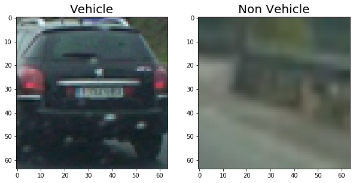
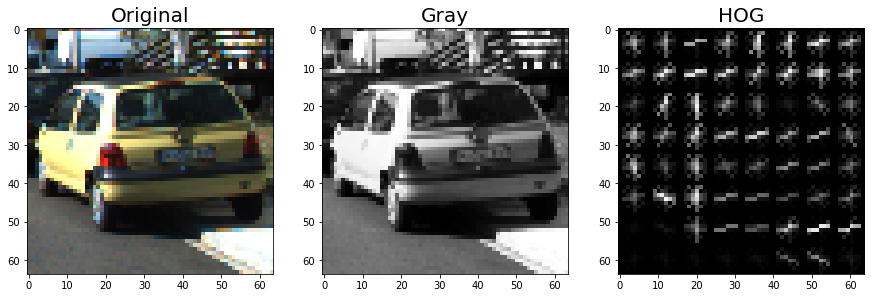
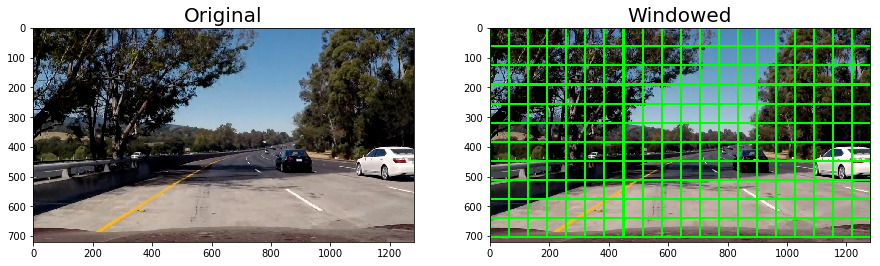
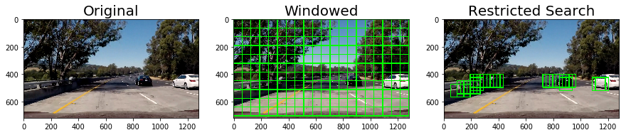
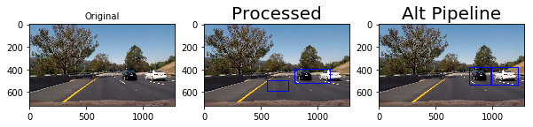
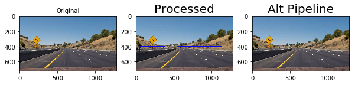
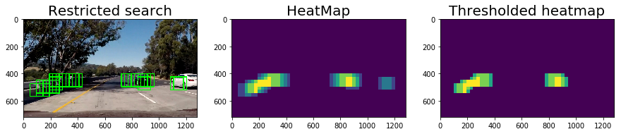

## Writeup Template

---

**Vehicle Detection Project**

The goals / steps of this project are the following:

* Perform a Histogram of Oriented Gradients (HOG) feature extraction on a labeled training set of images and train a classifier Linear SVM classifier
* Optionally, you can also apply a color transform and append binned color features, as well as histograms of color, to your HOG feature vector.
* Note: for those first two steps don't forget to normalize your features and randomize a selection for training and testing.
* Implement a sliding-window technique and use your trained classifier to search for vehicles in images.
* Run your pipeline on a video stream (start with the test_video.mp4 and later implement on full project_video.mp4) and create a heat map of recurring detections frame by frame to reject outliers and follow detected vehicles.
* Estimate a bounding box for vehicles detected.

[//]: # (Image References)
[image1]: ./examples/car_not_car.png
[image2]: ./examples/HOG_example.jpg
[image3]: ./examples/sliding_windows.jpg
[image4]: ./examples/sliding_window.jpg
[image5]: ./examples/bboxes_and_heat.png
[image6]: ./examples/labels_map.png
[image7]: ./examples/output_bboxes.png
[video1]: ./project_video.mp4

## [Rubric](https://review.udacity.com/#!/rubrics/513/view) Points
### Here I will consider the rubric points individually and describe how I addressed each point in my implementation.  

---


### Histogram of Oriented Gradients (HOG)

#### 1. Explain how (and identify where in your code) you extracted HOG features from the training images.

The code for this step is contained in the `lesson_functions.py` line `8` to line `18`.
```python
def get_hog_features(img, orient, pix_per_cell, cell_per_block, vis=False, feature_vec=True):

    if vis == True:
        features, hog_image = hog(img, orientations=orient, pixels_per_cell=(pix_per_cell, pix_per_cell), cells_per_block=(
            cell_per_block, cell_per_block), transform_sqrt=True, visualise=vis, feature_vector=feature_vec)
        return features, hog_image

    else:
        features = hog(img, orientations=orient, pixels_per_cell=(pix_per_cell, pix_per_cell), cells_per_block=(cell_per_block, cell_per_block),
                       transform_sqrt=True, visualise=vis, feature_vector=feature_vec)
        return features
```

and is used in the `Playground.ipynb` cell no `33`.

I started by reading in all the `vehicle` and `non-vehicle` images.  Here is an example of one of each of the `vehicle` and `non-vehicle` classes:

Here is an example
```python
f, (ax1, ax2) = plt.subplots(1, 2, figsize=(10,10))
vehicle = mpimg.imread("vehicles/GTI_Far/image0816.png")
ax1.imshow(vehicle)
ax1.set_title('Vehicle', fontsize=20)
non_vehicle = mpimg.imread("non-vehicles/GTI/image9.png")
ax2.imshow(non_vehicle)
ax2.set_title('Non Vehicle', fontsize=20)
```


I then explored different color spaces and different `skimage.hog()` parameters (`orientations`, `pixels_per_cell`, and `cells_per_block`).  I grabbed random images from each of the two classes and displayed them to get a feel for what the `skimage.hog()` output looks like.

Here is an example using the default color space and HOG parameters of `orientations=8`, `pixels_per_cell=(8, 8)` and `cells_per_block=(2, 2)`:



Reason we use hog is that it represents the unique features of images, how certains pixel groups together forms something that is unique about characteristics of the image and these features are what allows us to distinghuish.
See [this Quora Question Thread](https://www.quora.com/What-are-HOG-features-in-computer-vision-in-laymans-terms) for simple explanation.

#### 2. Explain how you settled on your final choice of HOG parameters.

I wanted to try differnet combinations but later settled on the ones that were originally used and provided in the lectures.

#### 3. Describe how (and identify where in your code) you trained a classifier using your selected HOG features (and color features if you used them).

I trained two SVM's one Linear and another non-Linear.

`from sklearn.svm import LinearSVC,SVC`

I noticed that Linear SVM is fast in predicting but less accurate while Non-Linear SVM is slow compared to Linear counterpart but more accurate. I didn't tweak with  other hyperparamters like Gamma, Penality and random state, though changing them and reaching a delicate balance between all of them could have proven beneficial.

* [LinearSVC Documentation ](http://scikit-learn.org/stable/modules/generated/sklearn.svm.LinearSVC.html)
* [SVC Documentation ](http://scikit-learn.org/stable/modules/generated/sklearn.svm.SVC.html)

### Sliding Window Search

#### 1. Describe how (and identify where in your code) you implemented a sliding window search.  How did you decide what scales to search and how much to overlap windows?

I used the sliding window approach provided in the lectures. Implementation can be found in `lesson_functions.py` lines `84` to `121`.

```python
def slide_window(img, x_start_stop=[None, None], y_start_stop=[None, None],
                 xy_window=(64, 64), xy_overlap=(0.5, 0.5)):
    # If x and/or y start/stop positions not defined, set to image size
    if x_start_stop[0] == None:
        x_start_stop[0] = 0
    if x_start_stop[1] == None:
        x_start_stop[1] = img.shape[1]
    if y_start_stop[0] == None:
        y_start_stop[0] = 0
    if y_start_stop[1] == None:
        y_start_stop[1] = img.shape[0]
    # Compute the span of the region to be searched
    xspan = x_start_stop[1] - x_start_stop[0]
    yspan = y_start_stop[1] - y_start_stop[0]
    # Compute the number of pixels per step in x/y
    nx_pix_per_step = np.int(xy_window[0] * (1 - xy_overlap[0]))
    ny_pix_per_step = np.int(xy_window[1] * (1 - xy_overlap[1]))
    # Compute the number of windows in x/y
    nx_windows = np.int(xspan / nx_pix_per_step) - 1
    ny_windows = np.int(yspan / ny_pix_per_step) - 1
    # Initialize a list to append window positions to
    window_list = []
    # Loop through finding x and y window positions
    # Note: you could vectorize this step, but in practice
    # you'll be considering windows one by one with your
    # classifier, so looping makes sense
    for ys in range(ny_windows):
        for xs in range(nx_windows):
            # Calculate window position
            startx = xs * nx_pix_per_step + x_start_stop[0]
            endx = startx + xy_window[0]
            starty = ys * ny_pix_per_step + y_start_stop[0]
            endy = starty + xy_window[1]

            # Append window position to list
            window_list.append(((startx, starty), (endx, endy)))
    # Return the list of windows
    return window_list
```
Default window size is `64,64` and overlapping of `50%`



Results with region restriction



#### 2. Show some examples of test images to demonstrate how your pipeline is working.  What did you do to optimize the performance of your classifier?

Ultimately I searched on two scales using YCrCb 3-channel HOG features plus spatially binned color and histograms of color in the feature vector, which provided a nice result.
But my pipeline was not robust was getting lots of false positives. So I used another implementation and it worked, key was to repeat the it for multiple scale sizes.
Alternate pipeline is inspired by  [emmyclau/CarND-Vehicle-Detection](https://github.com/emmyclau/CarND-Vehicle-Detection)
 Here are some example images:



See how false postives went down


---

### Video Implementation

#### 1. Provide a link to your final video output.  Your pipeline should perform reasonably well on the entire project video (somewhat wobbly or unstable bounding boxes are ok as long as you are identifying the vehicles most of the time with minimal false positives.)
Here's a [link to my video result](./project_video_processed.mp4)


#### 2. Describe how (and identify where in your code) you implemented some kind of filter for false positives and some method for combining overlapping bounding boxes.

I recorded the positions of positive detections in each frame of the video.  From the positive detections I created a heatmap and then thresholded that map to identify vehicle positions.  I then used `scipy.ndimage.measurements.label()` to identify individual blobs in the heatmap.  I then assumed each blob corresponded to a vehicle.  I constructed bounding boxes to cover the area of each blob detected. I experimented with smoothing heatmap over several frames but it was not efficient and performance gain was justifiable.

Here's an example result showing the heatmap from a series of frames of video, the result of `scipy.ndimage.measurements.label()` and the bounding boxes then overlaid on the last frame of video:

### Here is an example




---

### Discussion

#### 1. Briefly discuss any problems / issues you faced in your implementation of this project.  Where will your pipeline likely fail?  What could you do to make it more robust?

Here I'll talk about the approach I took, what techniques I used, what worked and why, where the pipeline might fail and how I might improve it if I were going to pursue this project further.  

##### What else I tried
I experiemented with [Haar Casscades](https://github.com/adityasiwan/vehicle_detection_haarcascades) as suggested by reviewer but even that had false positives but it was awesome and performance gain was great.
I used [YOLO](https://pjreddie.com/media/files/papers/yolo.pdf) as well but since I was not running it on CPU only, it took more than 12 seconds to process which was slighlty better than existing pipeline. Also YOLO was produced as binary blob, which meant incorporating in the existing pipeline involved shell calls emebedded and also default YOLO doesn't comes with OpenCV extension (there was some issues while compiling it Open CV support). However there is also a [tensorflow implementation of YOLO, named DarkFlow](https://github.com/thtrieu/darkflow) but it was crashing with YOLO v2 weights.

##### What were the issues
Main issue was the performance, one my system alternate pipeline took more than 5 hours to process 50 seconds of project video. So I spinned up a 16GB/8CPU droplet on DigitalOcean and it perfomed certinaly better.
On my system average iteration of pipleine took more than 139 seconds while on the droplet it was 12.8 seconds, it took around 3-4 hours to proces video on the droplet.
So clearly it's not real time and deep learning is the best approach to tackle this in IMO

##### Where will pipeline fail
It will fail on any alien data, since our model was trained on a small data.
If number of cars are much closer (like in traffic jam) or if there are vehicles other than cars (trucks, bikes) or if a vehicle is zapping fast enough.

##### What are my key take aways
I learnt a lot about Computer Vision (stuff like HOGs and Heatmaps),Scikit and machine learning.
More than that I learned how hard it is to produce a reliable model. It was challenging and rewarding at the same time. Staring at screen and jumping in joy when model works. Hours of waiting, tweaking and fiddling, it was all worth it .
More than that I have a new profound respect for those  who produce such awesome techniques,tools and models to create the future of humanity and pushing it one epoch at a time.

Here's to the crazy ones,brave and smart people :smile: :tada:
